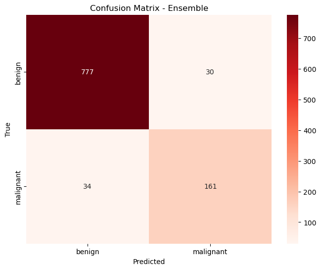
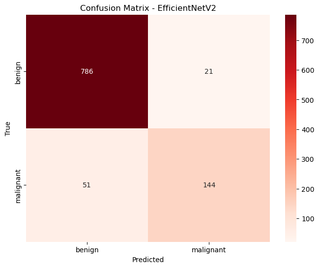

# Skin Cancer Detection using CNNs and Vision Transformers

[](https://opensource.org/licenses/MIT)

This repository contains the source code for the paper: **"Skin Cancer Detection Using Convolutional Networks and Vision Transformers"**.

**Authors:** Davi Israel Abtibol Carvalho, Fábio Cavalcante Binatti, Marly. G. F. Costa, Cícero F.F. Costa Filho

[//]: <> (**[Link to the Paper will be here]**)

## Abstract

Skin cancer, affecting over 1.5 million in 2022, poses a significant public health concern... An accuracy of 93.61% and an F1-score of 96.04% was obtained.

## Getting Started

### Prerequisites

*   Python 3.8+
*   PyTorch
*   CUDA

### Installation

1.  **Clone the repository:**
    ```bash
    git clone https://github.com/AbtibolDavi/skin-cancer-ensemble-paper.git
    cd skin-cancer-ensemble-paper
    ```
2.  **Create and activate a virtual environment (recommended):**
    ```bash
    python -m venv venv
    source venv/bin/activate  # On Windows, use `venv\Scripts\activate`
    ```
3.  **Install the required packages:**
    ```bash
    pip install -r requirements.txt
    ```
4.  **Download the Dataset:**
    Download the HAM10000 dataset from a source like the Harvard Dataverse and place it in the `data/` directory.

## Usage

1.  **Train the individual models:**
    ```bash
    python scripts/train_caformer.py
    python scripts/train_deit.py
    python scripts/train_efficientnet.py
    ```
2.  **Run the ensemble evaluation:**
    ```bash
    python scripts/ensemble.py
    ```

## Results

Our ensemble model, combining EfficientNetV2, DeiT Distilled, and CAFormer, achieved the following results on the HAM10000 dataset for binary classification:

| Model          | Accuracy (%) | Balanced Accuracy (%) | F1-Score (%) |
| -------------- | ------------ | --------------------- | ------------ |
| **Ensemble**   | **93.61**    | **89.42**             | **96.04**    |
| EfficientNetV2 | 92.81        | 89.50                 | 95.62        |

<p float="left">
  
  
</p>

## License

This project is licensed under the MIT License - see the [LICENSE](LICENSE) file for details.

## Acknowledgments

This research was funded by Samsung Electronics of Amazonia Ltda., under the terms of Federal Law n°8.387/1991, agreement 001/2020, signed with UFAM/FAEPI, Brazil.

[//]: <> (## Citation)

[//]: <> (If you use this code in your research, please cite our paper:)

[//]: <> (```bibtex
@inproceedings{your_paper_citation,
  title={Skin Cancer Detection Using Convolutional Networks and Vision Transformers},
  author={Carvalho, Davi Israel Abtibol and Binatti, Fábio Cavalcante and Costa, Marly. G. F. and Costa Filho, Cícero F.F.},
  year={2024}
})

